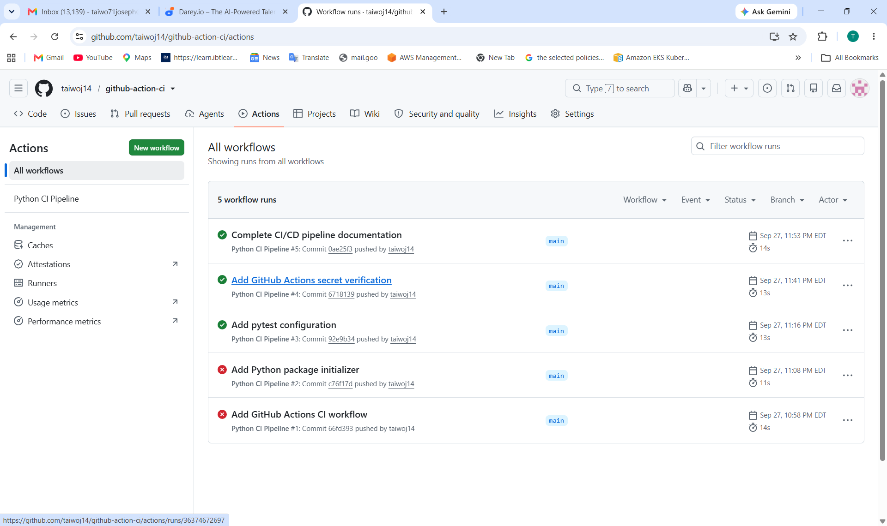
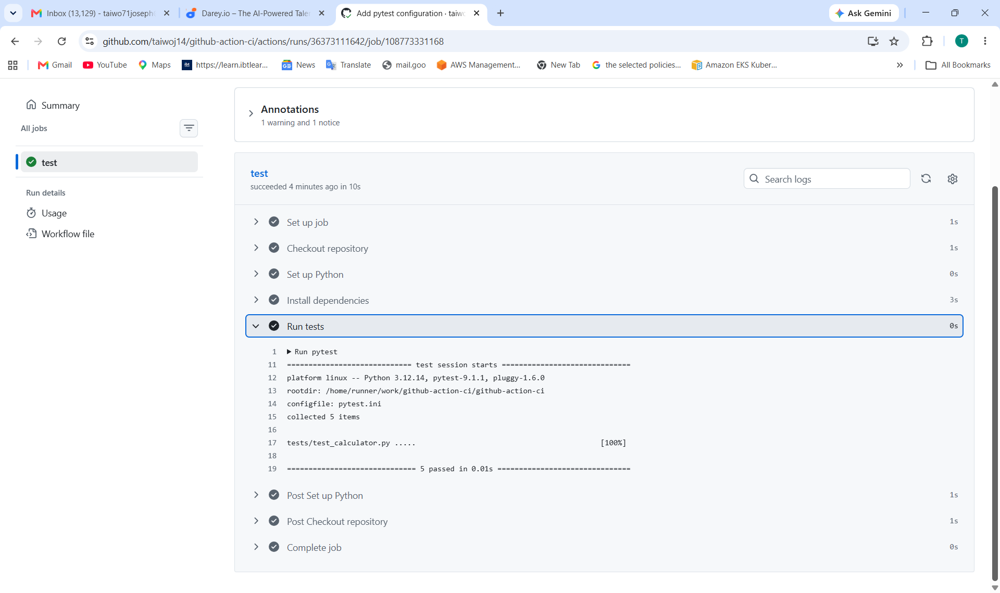
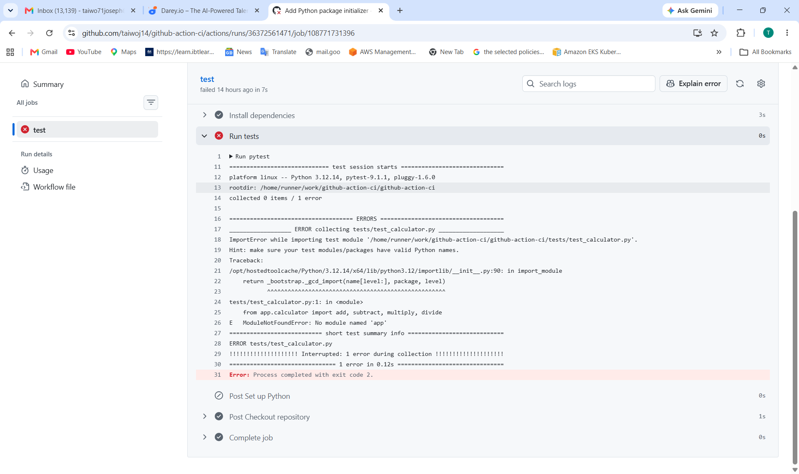

# GitHub Actions CI Pipeline

## Overview

This project demonstrates the design and implementation of a Continuous Integration (CI) pipeline using GitHub Actions.

The project uses a simple Python calculator application to demonstrate automated dependency installation, testing, caching, secret management, workflow monitoring, and troubleshooting.

The CI pipeline is defined as code using a YAML workflow stored inside the repository.

---

## Project Objectives

The objectives of this project are to:

* Understand Continuous Integration and event-driven automation.
* Configure GitHub Actions workflows using YAML.
* Use GitHub-hosted Ubuntu runners.
* Automatically install Python and project dependencies.
* Execute automated tests.
* Implement dependency caching.
* Demonstrate secure GitHub Secrets usage.
* Monitor workflow execution and troubleshoot failures.
* Document the CI pipeline and its results.

---

## Project Structure

```text
github-action-ci/
├── .github/
│   └── workflows/
│       └── ci.yml
├── app/
│   ├── __init__.py
│   └── calculator.py
├── tests/
│   └── test_calculator.py
├── screenshots/
│   ├── github-actions-success.png
│   ├── github-actions-tests.png
│   └── github-actions-troubleshooting.png
├── pytest.ini
├── requirements.txt
└── README.md
```

---

## Screenshots

### 1. Successful GitHub Actions Workflow



### 2. Five Tests Passed



### 3. Troubleshooting — ModuleNotFoundError



---

## Application

The application is a simple Python calculator containing functions for:

* Addition
* Subtraction
* Multiplication
* Division
* Division-by-zero error handling

---

## Automated Tests

The project uses `pytest` for automated testing.

The test suite contains five tests covering the calculator functions and division-by-zero handling.

The successful GitHub Actions run produced:

```text
============================= test session starts ==============================
platform linux -- Python 3.12.14, pytest-9.1.1, pluggy-1.6.0
rootdir: /home/runner/work/github-action-ci/github-action-ci
configfile: pytest.ini
collected 5 items

tests/test_calculator.py .....                                           [100%]

============================== 5 passed in 0.01s ===============================
```

---

## GitHub Actions Workflow

The workflow is located at:

```text
.github/workflows/ci.yml
```

### Workflow Trigger

The pipeline runs automatically when code is:

* Pushed to the `main` branch.
* Submitted through a pull request targeting the `main` branch.

### Job Environment

The workflow uses:

```yaml
runs-on: ubuntu-latest
```

This provides a GitHub-hosted Ubuntu runner for executing the CI job.

### Repository Checkout

The workflow uses:

```yaml
uses: actions/checkout@v4
```

This downloads the repository source code into the GitHub Actions runner.

### Python Setup

The workflow uses the Python setup action to install Python 3.12:

```yaml
uses: actions/setup-python@v5
with:
  python-version: "3.12"
```

### Dependency Installation

Project dependencies are defined in:

```text
requirements.txt
```

The workflow installs them using:

```bash
pip install -r requirements.txt
```

### Dependency Caching

The workflow enables pip caching:

```yaml
cache: "pip"
```

Caching can reduce the time required to install dependencies during subsequent workflow runs.

### Automated Testing

The workflow executes:

```bash
pytest
```

The current test suite contains five tests, all of which passed successfully.

---

## GitHub Secrets

The project demonstrates GitHub repository secrets using:

```text
DEMO_MESSAGE
```

The secret is passed to the workflow through the GitHub Actions secrets context:

```yaml
${{ secrets.DEMO_MESSAGE }}
```

The workflow checks that the secret is available without printing the secret value to the logs.

Sensitive credentials should never be hard-coded in source code or committed to GitHub.

---

## Troubleshooting

During development, the first CI execution failed during test collection with:

```text
ModuleNotFoundError: No module named 'app'
```

The initial solution was to add:

```text
app/__init__.py
```

However, the import error persisted on the GitHub-hosted runner.

A `pytest.ini` configuration file was then added:

```ini
[pytest]
pythonpath = .
```

This explicitly adds the repository root to the Python import path.

After the configuration was added, the workflow successfully discovered and executed all five tests.

Final result:

```text
5 passed
```

---

## CI Pipeline Flow

```text
Developer pushes code
        |
        v
GitHub Repository
        |
        v
GitHub Actions Trigger
        |
        v
Ubuntu Runner
        |
        +--> Checkout Code
        |
        +--> Setup Python
        |
        +--> Restore pip Cache
        |
        +--> Install Dependencies
        |
        +--> Run Pytest
        |
        +--> Verify GitHub Secret
        |
        v
     CI Result
        |
     +--+--+
     |     |
   Pass   Fail
     |     |
     v     v
 Success  Troubleshoot
```

---

## Key DevOps Concepts Demonstrated

* Continuous Integration
* Automation as code
* Event-driven automation
* GitHub Actions
* YAML workflow configuration
* GitHub-hosted runners
* Automated testing
* Dependency management
* Dependency caching
* Secret management
* CI troubleshooting
* Build and test visibility

---

## Project Requirements Completed

The project demonstrates the following required tasks:

### 1. Initialize Workflow Configuration

Created:

```text
.github/workflows/ci.yml
```

The YAML file contains the GitHub Actions CI pipeline configuration.

### 2. Configure Event Triggers

Configured the workflow to run on:

```yaml
push:
  branches:
    - main

pull_request:
  branches:
    - main
```

### 3. Define Job Environment

Configured the workflow to use:

```yaml
runs-on: ubuntu-latest
```

This provides a GitHub-hosted Ubuntu environment.

### 4. Implement Repository Checkout

The workflow uses:

```yaml
uses: actions/checkout@v4
```

This checks the repository source code out onto the GitHub Actions runner.

### 5. Setup Runtime and Dependencies

The workflow installs Python 3.12:

```yaml
uses: actions/setup-python@v5
with:
  python-version: "3.12"
```

Dependencies are installed using:

```bash
pip install -r requirements.txt
```

### 6. Automate Build and Test

The workflow executes:

```bash
pytest
```

The final workflow successfully passed all five automated tests:

```text
5 passed
```

### 7. Integrate Security and Optimization

The project demonstrates:

* GitHub repository secrets.
* Secure environment variable handling.
* Pip dependency caching.

The workflow uses:

```yaml
cache: "pip"
```

and:

```yaml
env:
  DEMO_MESSAGE: ${{ secrets.DEMO_MESSAGE }}
```

The secret value is not printed to the workflow logs.

### 8. Analyze and Debug

The initial workflow failed with:

```text
ModuleNotFoundError: No module named 'app'
```

The issue was investigated through the GitHub Actions logs.

The project was updated with:

```text
app/__init__.py
```

and:

```text
pytest.ini
```

containing:

```ini
[pytest]
pythonpath = .
```

After these changes, the workflow successfully discovered and executed all five tests.

---

## Final Workflow

The completed workflow is:

```yaml
name: Python CI Pipeline

on:
  push:
    branches:
      - main
  pull_request:
    branches:
      - main

jobs:
  test:
    runs-on: ubuntu-latest

    steps:
      - name: Checkout repository
        uses: actions/checkout@v4

      - name: Set up Python
        uses: actions/setup-python@v5
        with:
          python-version: "3.12"
          cache: "pip"

      - name: Install dependencies
        run: |
          python -m pip install --upgrade pip
          pip install -r requirements.txt

      - name: Run tests
        run: pytest

      - name: Verify GitHub Secret
        env:
          DEMO_MESSAGE: ${{ secrets.DEMO_MESSAGE }}
        run: |
          echo "Secret is available to the workflow."
          test -n "$DEMO_MESSAGE"
```

---

## Final Test Result

The GitHub Actions workflow successfully completed the test stage with:

```text
============================== 5 passed in 0.01s ===============================
```

The successful pipeline confirms that the application dependencies were installed correctly and that all five automated tests passed.

---

## Conclusion

This project demonstrates a GitHub Actions Continuous Integration pipeline for a Python application.

The pipeline automatically:

1. Detects code changes.
2. Starts a GitHub-hosted Ubuntu runner.
3. Checks out the repository.
4. Sets up Python 3.12.
5. Restores the pip dependency cache.
6. Installs project dependencies.
7. Runs automated tests.
8. Verifies access to a GitHub repository secret.
9. Reports the workflow result through GitHub Actions.

The project also demonstrates practical CI troubleshooting by identifying and resolving a Python module import error.

The final workflow completed successfully with all five automated tests passing.
